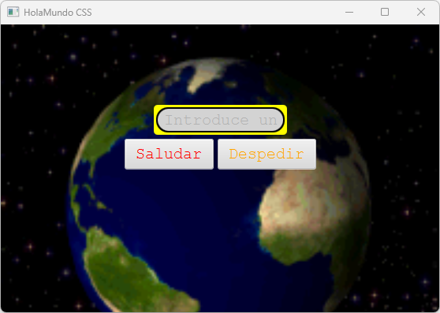

# HolaMundoCSS

HolaMundo en JavaFX usando hojas de estilos CSS.

]

## Requerimientos

Para poder **compilar** la aplicación es necesario:

- Maven
- JDK 11

## Para los desarrolladores

Instrucciones de <u>construcción</u> del proyecto:

```bash
mvn clean compile 
```

Para *ejecutar* desde el código compilado:

```bash
mvn exec:java
```

## Guía de usuario

Vete a [Google](https://google.com) y lo buscas o consulta [nuestra guía](docs/guia-usuario.md).
